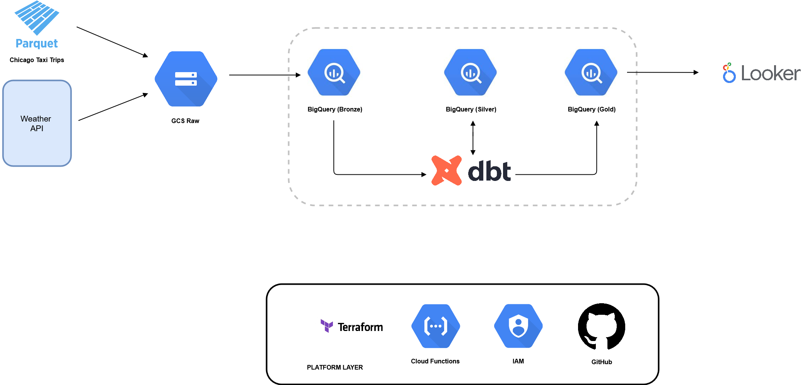

# Chicago Taxi Weather Pipeline

This repository contains the solution to the Astrafy Data Engineer Challenge.

## Challenge Description

Astrafy is helping out the city of Chicago with some of its analytics. One of the many datasets of interest refers to the “Chicago Taxi trips” which is publicly available on BigQuery.

The mayor of Chicago assumes that the weather conditions affect the duration of the trips. Because of this, he wants us to build a small Looker Studio dashboard that shows the eventual insight that weather conditions affect trip duration.

### Requirements

- Filter the taxi trips data on `trip_start_timestamp` from 2023-06-01 to 2023-12-31.
- Ingest new weather data daily for the day before.
- All infrastructure must be hosted in Google Cloud.
- All resources must be created via Terraform.
- Use dbt for data transformations.
- OPTIONAL: only your email should have access to the column `payment_type`.

## Architecture Overview




- **Terraform** for infrastructure-as-code.
- **Google Cloud Storage (GCS)** as the landing zone for raw weather data.
- **BigQuery** as the data warehouse for both taxi trips and weather data.
- **dbt** to transform data into staging and marts layers.
- **Cloud Functions** to orchestrate the daily ingestion pipeline.
- **Looker Studio** for data visualization.
- **GitHub Actions** for CI/CD.

## Project Structure

```
chicago-taxi-weather-pipeline/
│
│
├── terraform/
│   ├── main.tf
│   ├── variables.tf
│   ├── terraform.tfvars
│   └── outputs.tf
│
├── dags/
│   └── ingest_weather_dag.py
│
├── scripts/
│   └── historical_weather.py
│
├── dbt/
│   ├── dbt_project.yml
│   ├── profiles.yml
│   ├── analyses/
│   ├── macros/
│   ├── seeds/
│   ├── snapshots/
│   ├── tests/
│   └── models/
│       ├── staging/
│       │   ├── stg_chicago_taxi_trips.sql
│       │   ├── stg_weather.sql
│       │   └── schema.yml
│       └── marts/
│           ├── mart_trips_weather.sql
│           └── schema.yml
│
├── .github/
│    └── workflows/
│         └── deploy.yml
└── README.md
```

## How to Run Locally

### 1. Clone the repository

```
git clone https://github.com/carleondel/chicago-taxi-weather-pipeline.git
cd chicago-taxi-weather-pipeline
```

### 2. Create virtual environment

```
python3 -m venv venv
source venv/bin/activate
```

### 3. Install dependencies

```
pip install -r requirements.txt
```

### 4. Run historical weather download script

```
python scripts/historical_weather.py
```

This will download historical weather data from Open-Meteo and save it as a Parquet file locally.


## Terraform

### Initialize Terraform

```
cd terraform
terraform init
```

### Plan

```
terraform plan -var-file="terraform.tfvars"
```

### Apply

```
terraform apply -var-file="terraform.tfvars"
```

## dbt

### Initialize dbt profiles

Edit your `profiles.yml` to include your GCP project ID and service account JSON file path.

### Run dbt models

```
cd dbt
dbt run
```
### Run dbt tests

```
dbt test
```

## Cloud Functions

The DAG `ingest_weather_dag.py` performs the following tasks:

- Downloads daily weather data from the Open-Meteo API.
- Uploads raw data to GCS.
- Loads data into BigQuery.
- Runs dbt transformations.

## Looker Studio

Looker Studio will be connected to the BigQuery `marts` layer to visualize:

- Average trip duration vs. temperature.
- Average trip duration vs. precipitation.
- Trends over time.

## CI/CD

The pipeline includes GitHub Actions to:

- Validate Terraform syntax and plans.
- Run dbt build and tests.

## To-Do


- [ ] Complete Looker Studio dashboard.
- [ ] Implement column-level security for `payment_type`.
- [ ] Refactor CI/CD pipeline for deployments and tests.

---
## Column-Level Security

To restrict access to the `payment_type` column, implement BigQuery column-level access policies or use authorized views that exclude this column for non-authorized users.

---

**Note:** Parquet files generated locally (e.g. `historical_weather_2023.parquet`) are ignored from version control and must be uploaded to GCS for BigQuery ingestion.

---

## Looker Studio

Looker Studio connects directly to the BigQuery marts layer:

- Dataset: chicago-taxi-weather.ctw_marts
- Table: mart_trips_weather

Available visualizations:

- Average trip duration vs. temperature.
- Average trip duration vs. precipitation.
- Trends over time.
