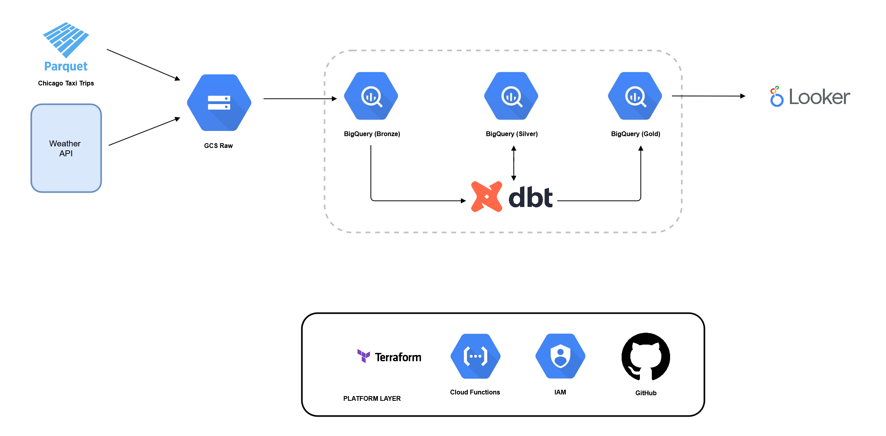

# Chicago Taxi Weather Pipeline

This repository contains the solution to the Astrafy Data Engineer Challenge.

[👉 **View Looker Studio Dashboard**](https://lookerstudio.google.com/reporting/3b513a83-c55d-45ee-92c3-12e9bb7e8665)

---

## Challenge Description

Astrafy is helping the City of Chicago with its analytics initiatives. One of the key datasets of interest is the publicly available “Chicago Taxi trips” on BigQuery.

The Mayor of Chicago suspects that weather conditions might affect the duration of taxi trips. This project builds a Looker Studio dashboard to analyze whether weather indeed impacts trip durations.

---

## Architecture Overview



- **Terraform** for infrastructure-as-code.
- **Google Cloud Storage (GCS)** as the landing zone for raw weather data.
- **BigQuery** as the data warehouse for both taxi trips and weather data.
- **dbt** to transform data into staging and marts layers.
- **Cloud Functions** to orchestrate the daily weather ingestion pipeline.
- **Looker Studio** for data visualization.
- **GitHub Actions** for CI/CD.

---

## Project Structure

```
chicago-taxi-weather-pipeline/
│
├── terraform/
│   ├── main.tf
│   ├── variables.tf
│   ├── terraform.tfvars
│   └── outputs.tf
│
├── cloud_functions/
│   ├── main.py
│   └── requirements.txt
│
├── scripts/
│   └── historical_weather.py
│
├── dbt/
│   ├── dbt_project.yml
│   ├── profiles.yml
│   ├── analyses/
│   ├── macros/
│   ├── seeds/
│   ├── snapshots/
│   ├── tests/
│   └── models/
│       ├── staging/
│       │   ├── stg_chicago_taxi_trips.sql
│       │   ├── stg_weather.sql
│       │   └── schema.yml
│       └── marts/
│           ├── mart_trips_weather.sql
│           └── schema.yml
│
├── .github/
│    └── workflows/
│         └── ci-cd-terraform.yml
└── README.md
```

---

## How to Run Locally

### Clone the repository

```bash
git clone https://github.com/carleondel/chicago-taxi-weather-pipeline.git
cd chicago-taxi-weather-pipeline
```

### Create virtual environment

```bash
python3 -m venv venv
source venv/bin/activate
```

### Install dependencies

```bash
pip install -r requirements.txt
```

### Run historical weather download script

```bash
python scripts/historical_weather.py
```

This downloads historical weather data from Open-Meteo and saves it as a Parquet file locally.

---

## Terraform

### Initialize Terraform

```bash
cd terraform
terraform init
```

### Plan

```bash
terraform plan -var-file="terraform.tfvars"
```

### Apply

```bash
terraform apply -var-file="terraform.tfvars"
```

---

## Cloud Function Deployment

The weather ingestion pipeline is implemented as a 2nd-gen Google Cloud Function. The function:

- Calls the Open-Meteo API
- Generates a Parquet file
- Uploads it to GCS
- Loads it into BigQuery (using WRITE_APPEND mode)

The function runs daily via Cloud Scheduler:

```bash
gcloud scheduler jobs create http weather-daily \
    --schedule="0 7 * * *" \
    --http-method=GET \
    --uri=https://us-central1-chicago-taxi-weather.cloudfunctions.net/ingest_weather \
    --time-zone="America/Chicago" \
    --location=us-central1
```

Note: The raw.weather table uses an append-only pattern. To avoid duplicate rows on repeated ingestion of the same date, a future enhancement could include deleting existing rows for the given date before loading new data.

---

## dbt

dbt transforms raw data into staging and marts layers. The mart is incremental:

- Materialized as `incremental`
- Uses `date` as the unique key
- Ensures only new data is processed on each run

### Initialize dbt profiles

Edit your `profiles.yml` to include your GCP project ID and service account JSON file path.

### Run dbt models

```bash
cd dbt
dbt run
```

### Run dbt tests

```bash
dbt test
```

---

## Looker Studio Dashboard

[👉 **View Looker Studio Dashboard**](https://lookerstudio.google.com/reporting/3b513a83-c55d-45ee-92c3-12e9bb7e8665)


### Key Insights from the Dashboard

- **Average trip duration** ranges between ~20 to 24 minutes across most days.
- **Trip durations slightly increase** with higher temperatures, suggesting warmer days might cause longer trips (e.g. more congestion).
- **Trip fares remain stable**, averaging around \$28–\$30.
- **Precipitation does not significantly impact** trip duration in the analyzed period.
- Seasonal variation is relatively mild, with moderate peaks in summer months.

---

## CI/CD

The pipeline includes GitHub Actions to:

- Validate Terraform syntax and plans.

---

## Column-Level Security

**Pending Implementation:**

To restrict access to the `payment_type` column, you could:

- Implement BigQuery policy tags (via Data Catalog).
- Or create authorized views excluding this column for non-authorized users.

---

## Future Automation

In the future, dbt can be automated using Cloud Run Jobs:

1. Build a Docker image with dbt installed and the project code.
2. Deploy it as a Cloud Run Job.
3. Trigger it daily via Cloud Scheduler.

This provides a lightweight and cost-effective solution for orchestrating dbt pipelines in production.

---

**Note:** Parquet files generated locally (e.g. `historical_weather_2023.parquet`) are ignored from version control and must be uploaded to GCS for BigQuery ingestion.
